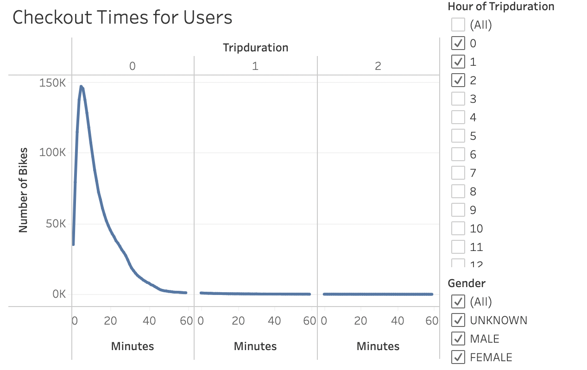
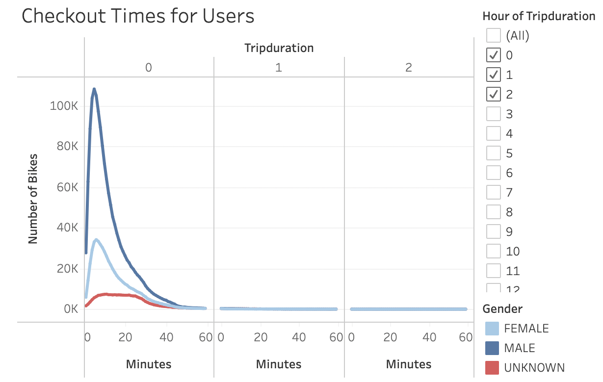
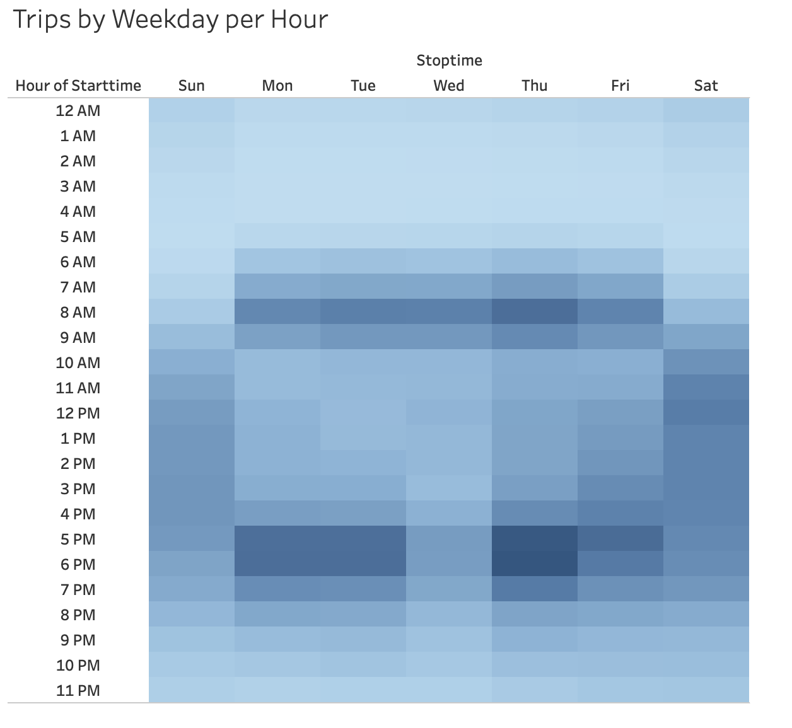
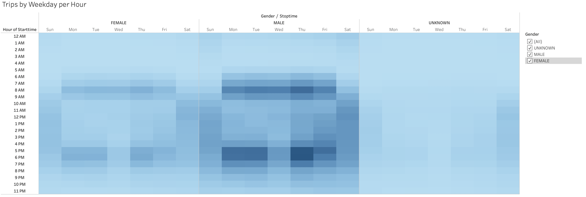
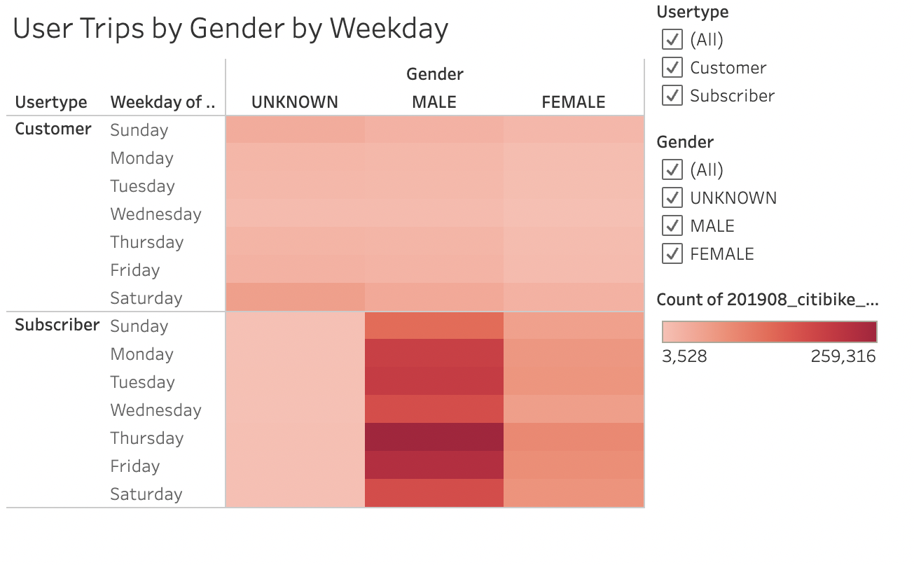
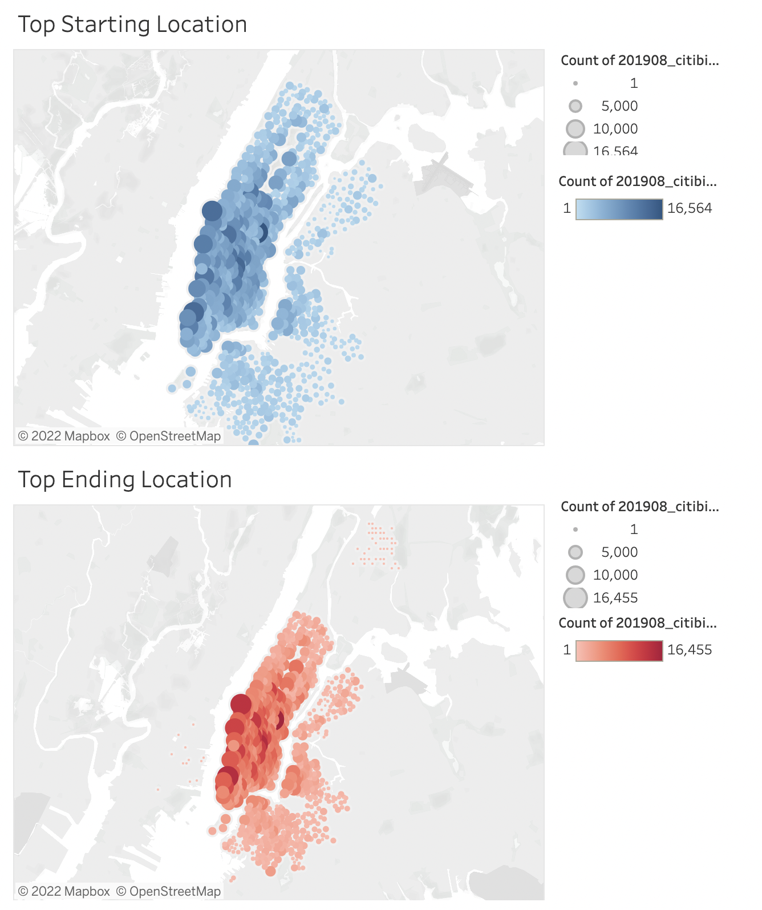

# CitiBike_Data

## Project Overview
In this module we analyzed NYC CitiBike data to see if a bike-sharing service woul dbe profitable in Des Moines, IA. A story was created using Tableau software to present to angel investors who are interested in funding the project. 

[link to dashboard](https://public.tableau.com/shared/5PBXJS5JX?:display_count=n&:origin=viz_share_link)

-----

## Results

### Deliverable 1: Change Trip Duration to a Datetime Format

#### code:

bike_data_df['tripduration'] = pd.to_datetime(bike_data_df['tripduration'], unit='s')

bike_data_df.to_csv('../Challenge/201908_citibike_data_dt.csv', index=False)

### Deliverable 2: Create Visualizations for the Trip Analysis

### Checkout times

Most users checkout bikes for less than 30 minutes. 

The majority of bike riders are male. 

### Trips by weekday

Alot of trips are made during rush hours. 

The majority of trips are made in rush hour for all genders. 

The majority of riders are subscribers. You can assume these are probably residents and not tourists. 

Alot of the bike rides are in one neighborhood. 

### Deliverable 3: Create a Story and Report for the Final Presentation
[link to dashboard](https://public.tableau.com/shared/5PBXJS5JX?:display_count=n&:origin=viz_share_link)

----

## Summary 

After analyzing the data, we found that the main users of the citi bikes are male subscribers to citi bikes. Bike users are more likely in the morning and evening times. This can lead us to believe that many people use citi bikes to get to and from their jobs during the week. We could conduct a survey of Des Moines residents to see if they would be interested in using a bike sharing service for their commute to work. 

Most citi bike trips are short lasting less than 20 minutes. It would be important to know the distance of Des Moines tourist attractions. 

I would also suggest analyzing the average miles traveled of riders. 
